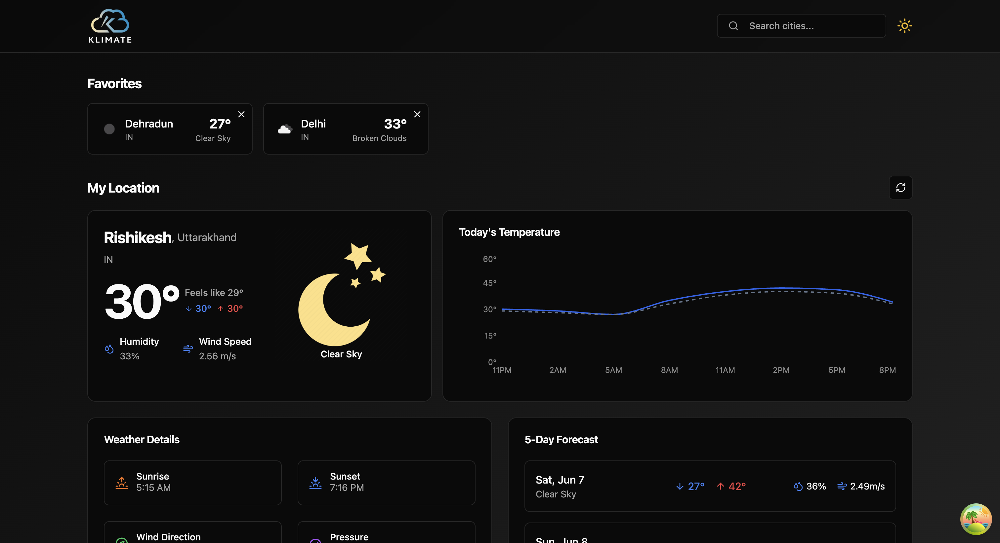
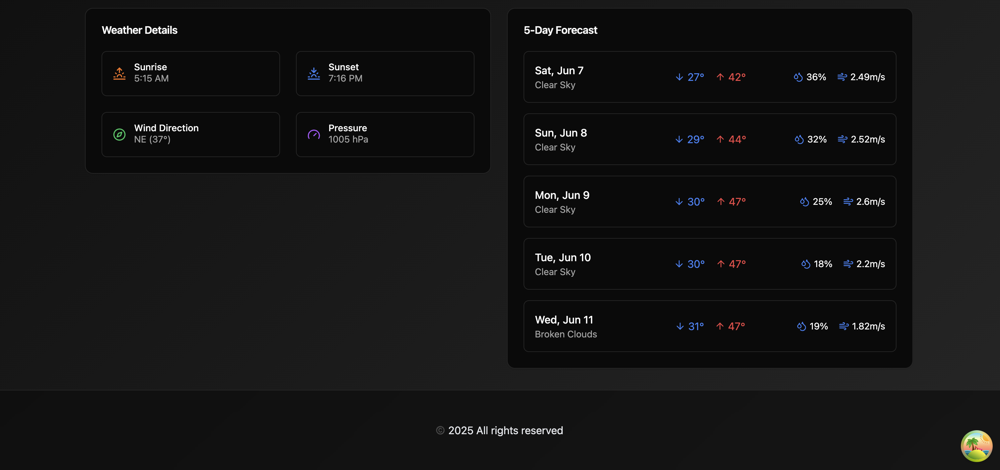

# 🌤️ Weather App

A sleek, modern weather forecasting web app built with **Next.js**, **React**, **TanStack Query**, **Shadcn UI**, **Recharts**, **Tailwind CSS**, and **TypeScript**.  
This app provides real-time weather updates, 5-day forecasts, and interactive weather visualizations in a responsive and accessible design.

---

## 🚀 Features

- 📍 **Search by City or Location** – Instantly fetch real-time weather data
- 📅 **5-Day Forecast** – View upcoming temperature, humidity, and conditions
- 📊 **Interactive Charts** – Visualize weather trends using Recharts
- ⚡ **Efficient Data Fetching** – Optimized with TanStack Query caching
- 🎨 **Clean, Accessible UI** – Built with Shadcn UI and Tailwind CSS
- 🛡️ **Fully Type-Safe Codebase** – Powered by TypeScript
- 📱 **Mobile-Responsive Design** – Works seamlessly on all devices

---

## 🧱 Tech Stack

| Technology        | Role                                |
|-------------------|-------------------------------------|
| **Next.js**        | Fullstack React framework (SSR/SSG) |
| **React**          | Frontend UI component library        |
| **TanStack Query** | Async data fetching and caching     |
| **Shadcn UI**      | Headless accessible UI components   |
| **Tailwind CSS**   | Utility-first CSS framework         |
| **Recharts**       | Charting and data visualization     |
| **TypeScript**     | Strongly typed JavaScript           |

---

## 📸 Screenshots


  


---

## 📦 Installation

## 1. Clone the Repository

```bash
git clone https://github.com/your-username/weather-app.git
cd weather-app
```

## 2. Install Dependencies
```bash
npm install
```

## 🔑 How to Get OpenWeatherMap API Key

To use this Weather App, you need an API key from **OpenWeatherMap**. Follow the steps below to generate your key:

---

### 📝 Step-by-Step Guide

1. 🌐 Go to [https://openweathermap.org/api](https://openweathermap.org/api)
2. 🔐 Sign up for a free account (or log in if you already have one)
3. 👤 Navigate to your **Dashboard**
4. ➕ Click on **"Create API Key"** (usually under the "API Keys" section)
5. 📝 Give it a name (e.g., `weather-app-key`)
6. ✅ Your API key will be generated — **copy it**


## 🔐 Environment Variables

## 1. Create a .env.local file in the root directory
```bash
touch .env.local
```

## 2. Add the following line to .env.local
```bash
VITE_OPENWEATHER_API_KEY=your_openweathermap_api_key
```
👉 You can get a free API key from OpenWeatherMap

---

## 🧪 Run the App

Start the development server:
```bash
npm run dev
```
Then open your browser at:

http://localhost:xxxx
